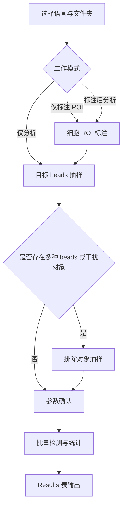
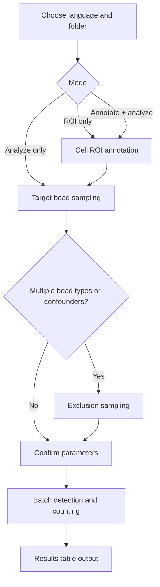
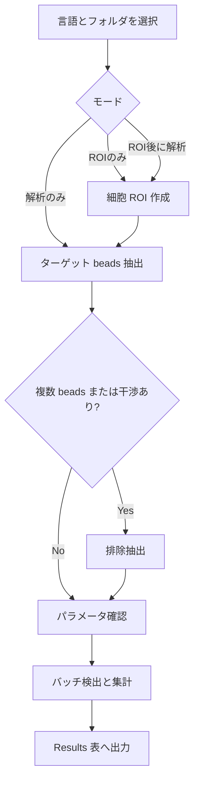

# 巨噬细胞图像四元素值分析  
**Macrophage Image Four-Factor Analysis**

---

## 一、项目简介

本仓库提供基于 **Fiji / ImageJ（ImageJ Macro Language）** 的图像分析宏，用于对显微镜图像中的**巨噬细胞与磁珠（beads）**进行半自动定量分析（当前脚本版本：v2.2）。

功能范围包括：
- 手动标注细胞 ROI
- 自动检测磁珠（支持亮珠、暗珠及团聚情况）
- 目标 beads 抽样与可选排除过滤
- 统计每张图像的“四要素”指标（可附带微量吞噬修正）
- 多语言界面（中文 / English / 日本語）
- 高性能批量处理
- 可控的严格程度与调试模式

设计目标：  
**在保证分析结果可解释、可控的前提下，尽可能提升自动化水平与处理效率。**

---

## 二、功能概览

### 1) 工作模式
启动后可在下拉菜单中选择三种模式：

1. **仅标画细胞 ROI**  
   - 逐张打开图像  
   - 手动勾画细胞轮廓  
   - 保存为 `*_cells.zip`  
   - 不进行磁珠分析  

2. **仅分析四要素**  
   - 直接对已有细胞 ROI 的图像进行分析  
   - 若缺少 ROI，可选择补标注或跳过  
   - 仍需进行 beads 抽样与参数确认  

3. **标画细胞 ROI 后分析四要素（推荐）**  
   - 完整工作流  
   - 先标注细胞，再进行磁珠抽样与批量分析  

---

### 2) 输出的“四要素”（含可选修正列）
每张图像在 Results 表中输出一行记录，字段如下：

| 字段名 | 含义 |
|------|------|
| Image | 图像文件名（不含扩展名） |
| Total Beads | 检测到的磁珠总数（含团聚估算） |
| Beads in Cells | 位于细胞 ROI 内的磁珠数量 |
| Cells with Beads | 至少包含 ≥1 个磁珠的细胞数量 |
| Cells with Beads (Adj) | （可选）忽略“微量吞噬”后的细胞数量 |
| Total Cells | 该图像中的细胞总数 |

即使某张图像因缺少 ROI 被跳过，结果表仍会保留一行（值为空），以保证数据对齐。

---

## 三、使用方法

### 1) 环境要求
- Fiji（推荐最新版本）或 ImageJ  
- 支持的图像格式：  
  `.tif / .tiff / .png / .jpg / .jpeg`（大小写不敏感）

---

### 2) 运行宏（推荐方式，避免乱码）
不建议使用：

- 打开 Fiji  
- `Plugins → Macros → Run...`  
- 选择本项目的 `.ijm` 宏文件  

原因：在部分系统与 Fiji 版本中，该方式可能导致**非英文字符（中文/日文）乱码**。

推荐方式（可稳定保留 UTF-8 编码）：

1. 打开 Fiji  
2. **将 `.ijm` 宏文件直接拖入 Fiji 主窗口**  
3. Fiji 会自动打开 **Macro Editor（宏编辑器）**  
4. 在宏编辑器中点击 **Run** 按钮运行  

---

## 四、核心流程（v2.2）

宏采用分步交互式流程执行：

1) **细胞 ROI 标注**（可选）  
   - 逐张打开图像  
   - 手动勾画细胞轮廓并加入 ROI Manager  
   - 保存为 `*_cells.zip`（后续可在参数中修改后缀）

2) **目标 beads 抽样**  
   - 圈选若干“典型单个 beads”  
   - 用于推断默认面积范围、团块估算尺度与 Rolling Ball 建议值

3) **排除对象抽样（可选）**  
   - 适用于存在多种 beads 或干扰对象时  
   - 推断排除阈值（以及可选的面积门控范围）

4) **参数确认 → 批量分析**  
   - 可调整严格程度、面积范围、圆形度、背景扣除等  
   - 批量分析在静默模式下运行，以提升效率

---

### 流程图



---

## 五、核心原理详解（从输入到结果）

### 1) 设计思想：分离“细胞 ROI”和“磁珠检测”

在显微图像中：
- 细胞边界复杂、变化大、对焦与染色差异明显 → 全自动分割往往不稳定
- 磁珠形态相对一致（近似圆形、尺寸范围有限） → 更适合自动检测

因此本宏采用以下策略：
- **细胞：人工标注 ROI（高可靠性、可解释）**
- **磁珠：自动检测 + 规则筛选（高效率、可调参数）**

该策略是生物图像定量中常见且稳健的半自动工作流。

---

### 2) 输入与预处理
- 读取用户选择文件夹内的图像（tif/tiff/png/jpg/jpeg），按文件名排序并建立对应的 ROI 路径。  
- 所有处理在 2D 模式下执行，像素单位固定为 pixel，以保证面积与半径估计一致。  

---

### 3) 细胞 ROI → 标签图（提高统计速度）
- 如果存在 ROI，脚本将每个细胞 ROI 填充为 **16-bit 标签图**（每个细胞一个 ID）。  
- 在统计 beads 是否落入细胞时，通过读取标签像素进行快速判定。  
- 若标签图生成失败或 ROI 无效，将提示错误并终止，以避免错误统计。  

---

### 4) 目标 beads 抽样 → 参数初值估计
由用户圈选“典型单个 beads”，脚本对这些 ROI 进行测量：
- **面积分布 → 估计 beads 面积范围与代表面积**  
  - 使用中位数、分位数与 IQR 进行鲁棒估计  
  - 自动剔除极端值，样本不足时采用保守范围  
- **代表面积 → Rolling Ball 半径**  
  - 用 `unitArea → 直径` 的经验换算关系估计背景扣除半径  

---

### 5) 排除对象抽样（可选）
适用于存在多种 beads 或干扰对象时：  
- 根据排除样本 ROI 的灰度分布，估计排除方向（高/低灰度）与阈值  
- 可选学习“排除对象”面积门控范围  
- 若分布重叠或样本不足，则采用保守阈值  

---

### 6) 磁珠检测算法（双通道融合）
脚本采用 **两种检测路径并融合**，以提升鲁棒性：

**A. 阈值路径（Yen）**
- 灰度图 → 自动阈值（Yen）  
- 转二值、填孔、形态学开运算、Watershed  
- 按面积与圆形度筛选候选  

**B. 边缘路径（Find Edges + Otsu）**
- 边缘增强 → 自动阈值（Otsu）  
- 转二值、填孔、开运算、Watershed  
- 同样按面积与圆形度筛选候选  

两条路径检测到的候选点按距离进行合并：
- 近邻阈值根据代表面积推导（等效半径 × 0.8）  
- 相邻候选中保留面积更大的点  

**严格度（Strictness）影响融合策略：**
- Strict：仅保留“双通道一致”或面积较大的候选  
- Normal：默认并集策略  
- Loose：更宽松的候选保留  

---

### 7) 团块 beads 的数量估计
- 若允许团块估算，脚本将用 `面积 / 代表面积` 估算 beads 数  
- 估算值被限制在合理范围（上限 80），防止极端面积导致夸大  

---

### 8) 细胞内 beads 判定
- 有标签图时：直接读取像素值判断是否落入某细胞  
- 无标签图时：回退为 ROI 边界判断（较慢但可用）  
- 统计结果包括：  
  - 总 beads 数  
  - 细胞内 beads 数  
  - 至少包含 beads 的细胞数  

---

### 9) 微量吞噬修正（可选）
- 若启用“Treat tiny uptake as no uptake”，脚本将统计每个细胞的 beads 数  
- 以非零细胞的 **中位数与 75 分位数** 计算动态阈值  
- 小于该阈值的细胞不计为吞噬细胞，输出 `Cells with Beads (Adj)`  

---

### 10) 结果输出与缺失 ROI 处理
- 所有图像都会输出一行结果，即使缺失 ROI 被跳过  
- 缺失 ROI 时可选择：补标注 / 跳过 / 跳过全部 / 退出  
- 结果表字段完整对应 “四要素” 与可选修正列  

---

## 六、参数与微调

### 1) UI 可调参数（按参数窗口顺序）

**A. 单一 beads（未勾选“包含多种 beads”）**

1. 「最小面积（px²）」：候选 beads 的最小面积阈值。  
2. 「最大面积（px²）」：候选 beads 的最大面积阈值。  
3. 「最小圆形度（0–1）」：按圆形度过滤非 beads 形状。  
4. 「团块估算：按面积拆分计数」：允许团块按面积估算 beads 数。  
5. 「微量吞噬阈值（动态计算）」：启用“微量吞噬”动态阈值修正。  
6. 「严格程度」：检测融合与过滤强度。选项为「严格 / 正常（推荐） / 宽松」。  
7. 「Rolling Ball 半径」：背景扣除半径。  
8. 「ROI 文件后缀」：ROI 文件名后缀（不含扩展名）。  

**B. 多种 beads（勾选“包含多种 beads”）**

1. 「最小面积（px²）」：候选 beads 的最小面积阈值。  
2. 「最大面积（px²）」：候选 beads 的最大面积阈值。  
3. 「最小圆形度（0–1）」：按圆形度过滤非 beads 形状。  
4. 「团块估算：按面积拆分计数」：允许团块按面积估算 beads 数。  
5. 「微量吞噬阈值（动态计算）」：启用“微量吞噬”动态阈值修正。  
6. 「严格程度」：检测融合与过滤强度。选项为「严格 / 正常（推荐） / 宽松」。  
7. 「Rolling Ball 半径」：背景扣除半径。  
8. 「ROI 文件后缀」：ROI 文件名后缀（不含扩展名）。  
9. 「启用排除过滤」：启用排除过滤（灰度阈值）。  
10. 「排除方向」：选择阈值方向。选项为「排除亮对象（≥ 阈值） / 排除暗对象（≤ 阈值）」。  
11. 「阈值（0–255）」：排除过滤的灰度阈值。  
12. 「动态阈值（更严格）」：启用更严格的动态阈值。  
13. 「面积范围门控（推荐）」：仅对指定面积范围应用排除阈值。  
14. 「最小面积（px²）」：排除对象面积下限。  
15. 「最大面积（px²）」：排除对象面积上限。  

---

### 2) 脚本级调整（非 UI）

- 默认面积/圆形度/背景值来自 `DEF_MINA`、`DEF_MAXA`、`DEF_CIRC`、`DEF_ROLL`，可按实验条件调整。  
- 面积分布鲁棒估计逻辑位于 `estimateAreaRangeSafe`，可调整分位数、IQR 与裁剪规则。  
- Rolling Ball 经验公式位于 `estimateRollingFromUnitArea`，可调整系数或 clamp 范围。  
- 双通道检测位于 `detectBeadsFusion`，可更换阈值算法、形态学序列或合并距离（`mergeDist`）。  
- 严格度缩放系数在参数验证段（`effMinArea/effMaxArea/effMinCirc`），适用于特定数据集调优。  
- 团块估算阈值与上限位于 `countBeadsByFlat`（`clumpThresh`、最大 80），可调整估算策略。  
- 微量吞噬阈值逻辑位于 `countBeadsByFlat`（中位数/75 分位），可替换为固定阈值或其他统计量。  
- 排除过滤策略位于 `estimateExclusionSafe`，可修改灰度差判定与阈值策略。  
- ROI 标签图使用 16-bit 且上限 65535，可调整策略以处理超大 ROI 数量。  

---

## 七、本地化与多语言

- 所有 UI 文本集中在脚本前部定义，便于统一维护。  
- 新增语言时可复制并翻译对应语言块。  
- 本地化不影响核心算法逻辑。  

---

## 八、许可证建议

- 推荐使用 MIT License。  
- 若要求修改后必须开源，可采用 GPL-3.0。  

---

# Macrophage Image Four-Factor Analysis  
**README (English Version)**

---

## 1. Overview

This repository provides a **Fiji / ImageJ macro** for semi-automated quantitative analysis of **macrophage images with beads** (current script version: v2.2).

Key capabilities include:
- Manual cell ROI annotation
- Automated bead detection (bright beads, dark beads, and clusters)
- Target bead sampling with optional exclusion filtering
- Per-image four-factor statistics (with optional tiny-uptake adjustment)
- High-performance batch processing
- Multilingual UI (Chinese / English / Japanese)

The objective is to increase automation and throughput while maintaining interpretability and control.

---

## 2. How to Run (Recommended)

Do not use the following method:

```
Fiji → Plugins → Macros → Run...
```

This method may cause **non-English characters to appear as garbled text** on some systems.

Use the following method:

1. Open Fiji
2. **Drag and drop the `.ijm` macro file into the Fiji window**
3. Fiji opens the **Macro Editor**
4. Click **Run** to execute

---

## 3. Workflow (v2.2)

The macro executes an interactive, stepwise workflow:

1) **Cell ROI annotation** (optional)  
   - Open images one by one  
   - Manually trace cells and add to ROI Manager  
   - Save as `*_cells.zip` (suffix adjustable later)

2) **Target bead sampling**  
   - Select several typical single beads  
   - Used to estimate default area range, clump scale, and Rolling Ball value

3) **Exclusion sampling (optional)**  
   - For multiple bead types or confounding artifacts  
   - Learns exclusion threshold (and optional size gate)

4) **Confirm parameters → Batch analysis**  
   - Adjust strictness, size range, circularity, background subtraction  
   - Batch analysis runs in quiet mode for performance

---

### Flowchart



---

## 4. Core Principles (from input to results)

### 1) Design idea: manual cell ROIs + automated bead detection
Cell boundaries are complex and highly variable, making fully automatic segmentation unreliable. Beads have more consistent morphology and size constraints.

Thus:
- Cells are annotated manually
- Beads are detected automatically

---

### 2) Input and preprocessing
- Read images from the selected folder (tif/tiff/png/jpg/jpeg), sort by filename, and map ROI paths.  
- Force 2D mode and pixel units to keep area and radius estimates consistent.  

---

### 3) Cell ROI → label mask (speed for counting)
- If ROIs exist, the macro fills each ROI into a **16-bit label mask** (one ID per cell).  
- This enables fast “bead-in-cell” checks via pixel lookup.  
- Invalid ROIs or failed mask generation will stop the run to prevent incorrect results.  

---

### 4) Target bead sampling → initial parameter estimates
Users sample “typical single beads,” and the macro measures them:
- **Area distribution → bead size range + unit area**  
  - Uses median, quantiles, and IQR for robust estimates  
  - Falls back to conservative bounds when samples are scarce  
- **Unit area → Rolling Ball radius**  
  - Converts unit area to a diameter and applies an empirical rule  

---

### 5) Exclusion sampling (optional)
Used when multiple bead types or confounding artifacts exist:  
- Estimates exclusion direction (high/low intensity) and threshold from gray-value distributions  
- Optionally learns a size gate for exclusion candidates  
- Falls back to conservative thresholds when distributions overlap  

---

### 6) Bead detection (dual-path fusion)
The macro combines **two detection paths** for robustness:

**A. Threshold path (Yen)**
- Auto-threshold (Yen) on grayscale  
- Binary mask → fill holes → morphological open → watershed  
- Filter candidates by area and circularity  

**B. Edge path (Find Edges + Otsu)**
- Edge enhancement → auto-threshold (Otsu)  
- Binary mask → fill holes → open → watershed  
- Filter by area and circularity  

Candidates from both paths are merged by distance:
- Merge radius is derived from unit area (equivalent radius × 0.8)  
- Keep the larger-area candidate when merging  

**Strictness affects fusion:**
- Strict: keep only dual-path matches or larger candidates  
- Normal: union by default  
- Loose: more permissive retention  

---

### 7) Clump estimation
- If enabled, clumps are estimated by `area / unitArea`  
- The estimate is capped (max 80) to prevent extreme inflation  

---

### 8) Bead-in-cell assignment
- With a label mask: assign by pixel value  
- Without a mask: fall back to ROI boundary checks (slower)  
- Produces:
  - Total beads  
  - Beads in cells  
  - Cells with beads  

---

### 9) Tiny-uptake adjustment (optional)
- If enabled, the macro computes a dynamic threshold from per-cell bead counts  
- Uses the median and 75th percentile of non-zero counts  
- Cells below the threshold are excluded from `Cells with Beads (Adj)`  

---

### 10) Output and missing ROI handling
- Every image keeps a result row, even if skipped due to missing ROIs  
- Missing ROIs can be annotated on the spot, skipped, or skipped for all  
- Output columns match the four factors plus the optional adjusted column  

---

## 5. Outputs (Results Table)

Each image writes one row to Results:

| Field | Meaning |
|------|------|
| Image | Image filename (without extension) |
| Total Beads | Total beads detected (including clump estimate) |
| Beads in Cells | Beads inside cell ROIs |
| Cells with Beads | Cells with ≥1 bead |
| Cells with Beads (Adj) | (Optional) cells after excluding tiny uptake |
| Total Cells | Total cells in the image |

Skipped images still keep an empty row to preserve alignment.

---

## 6. Parameters

### 1) UI-adjustable parameters (in dialog order)

**A. Single bead type (without “Multiple bead types” checked)**

1. "Target bead minimum area (px^2)": minimum bead area threshold.  
2. "Target bead maximum area (px^2)": maximum bead area threshold.  
3. "Target bead minimum circularity (0–1)": filters non-bead shapes by circularity.  
4. "Estimate bead counts from clumps by area": estimate bead counts within clumps by area.  
5. "Treat tiny uptake as no uptake (dynamic threshold, default on)": enable tiny-uptake adjustment.  
6. "Detection strictness": fusion/filters. Options: "Strict / Normal (recommended) / Loose".  
7. "Background Rolling Ball radius": background subtraction radius.  
8. "Cell ROI file suffix (without extension)": ROI file suffix.  

**B. Multiple bead types (with “Multiple bead types” checked)**

1. "Target bead minimum area (px^2)": minimum bead area threshold.  
2. "Target bead maximum area (px^2)": maximum bead area threshold.  
3. "Target bead minimum circularity (0–1)": filters non-bead shapes by circularity.  
4. "Estimate bead counts from clumps by area": estimate bead counts within clumps by area.  
5. "Treat tiny uptake as no uptake (dynamic threshold, default on)": enable tiny-uptake adjustment.  
6. "Detection strictness": fusion/filters. Options: "Strict / Normal (recommended) / Loose".  
7. "Background Rolling Ball radius": background subtraction radius.  
8. "Cell ROI file suffix (without extension)": ROI file suffix.  
9. "Enable exclusion filter (intensity threshold)": enable exclusion by intensity.  
10. "Exclusion direction": threshold direction. Options: "Exclude brighter objects (intensity ≥ threshold) / Exclude darker objects (intensity ≤ threshold)".  
11. "Exclusion threshold (0–255)": intensity threshold.  
12. "Stronger exclusion (dynamic threshold, stricter)": stricter dynamic thresholding.  
13. "Apply exclusion only within an exclusion size range (recommended)": apply exclusion only within size range.  
14. "Exclusion minimum area (px^2)": exclusion size lower bound.  
15. "Exclusion maximum area (px^2)": exclusion size upper bound.  

---

### 2) Script-level adjustments (non-UI)

- Defaults are defined via `DEF_MINA`, `DEF_MAXA`, `DEF_CIRC`, `DEF_ROLL`.  
- Robust area inference is implemented in `estimateAreaRangeSafe` (quantiles, IQR, trimming).  
- Rolling Ball estimation is implemented in `estimateRollingFromUnitArea` (scales + clamp).  
- Dual-path detection and merge logic are implemented in `detectBeadsFusion` (`mergeDist`).  
- Strictness scaling is applied during parameter validation (`effMinArea/effMaxArea/effMinCirc`).  
- Clump estimation uses `clumpThresh` and caps at 80 in `countBeadsByFlat`.  
- Tiny-uptake adjustment uses median/75th percentile in `countBeadsByFlat`.  
- Exclusion thresholding is implemented in `estimateExclusionSafe` (diff threshold, overlap handling).  
- Label masks are 16-bit with a 65535 cell cap.  

---

## 7. License

MIT License is recommended. Use GPL-3.0 if copyleft is required.

---

# マクロファージ画像4要素解析  
**README（日本語版）**

---

## 1. 概要

本リポジトリは、**Fiji / ImageJ マクロ**を用いて**マクロファージ画像中の beads**を半自動で定量するツールを提供します（スクリプト版：v2.2）。

機能範囲は次のとおりです：
- 細胞 ROI の手動アノテーション
- beads 自動検出（明るい/暗い beads と塊を含む）
- ターゲット beads 抽出と排除フィルター（任意）
- 画像ごとの四要素統計（微量貪食の補正あり）
- 高速バッチ処理
- 多言語 UI（中文 / English / 日本語）

結果の解釈性を維持しつつ、自動化と処理効率の向上を目指します。

---

## 2. 実行方法（推奨）

推奨しない方法：

```
Fiji → Plugins → Macros → Run...
```

この方法は、環境によって非英語文字が文字化けする可能性があります。

推奨方法：

1. Fiji を起動  
2. `.ijm` マクロを Fiji ウィンドウへドラッグ＆ドロップ  
3. Macro Editor が開く  
4. **Run** をクリックして実行  

---

## 3. ワークフロー（v2.2）

1) **細胞 ROI 作成**（任意）  
   - 画像を順番に開く  
   - ROI を描いて ROI Manager に追加  
   - `*_cells.zip` として保存（後で suffix 変更可）

2) **ターゲット beads 抽出**  
   - 典型的な単体 beads を複数選択  
   - 面積範囲・塊推定・Rolling Ball の既定値を推定

3) **排除抽出（任意）**  
   - 複数 beads や干渉がある場合に使用  
   - 排除方向と閾値（面積門控も任意）を推定

4) **パラメータ確認 → バッチ解析**  
   - 厳しさ、面積、円形度、背景補正を調整  
   - バッチ解析は静かに高速実行

---

### フローチャート



---

## 4. コア原理（入力から結果）

### 1) 設計思想：細胞 ROI と beads 検出の分離
細胞境界は複雑で変動が大きく、完全自動分割は不安定になりやすい一方、beads は形状・サイズが比較的一定で自動検出に適します。  
そのため **細胞 ROI は手動**、**beads は自動検出**という堅牢な半自動フローを採用しています。

---

### 2) 入力と前処理
- 画像を読み込み、ファイル名でソートして ROI パスを対応付けます。  
- 2D 固定・pixel 単位固定で面積/半径推定の整合性を保ちます。  

---

### 3) 細胞 ROI → ラベルマスク
- ROI を **16-bit ラベル画像**として塗り分け、細胞 ID を割り当てます。  
- beads が細胞内にあるかを高速に判定できます。  

---

### 4) ターゲット beads 抽出 → 初期推定
- 面積分布をロバストに推定して範囲と代表面積を決定します。  
- 代表面積から Rolling Ball 半径を経験則で推定します。  

---

### 5) 排除抽出（任意）
- 排除対象の灰度分布から方向（高/低）と閾値を推定します。  
- 必要に応じて面積門控を学習します。  

---

### 6) beads 検出（2 系統の融合）
- **Yen 閾値系**と**エッジ系（Find Edges + Otsu）**の候補を統合。  
- 近接候補は面積の大きい方を保持。  
- Strictness により統合条件を変更。  

---

### 7) 塊の beads 数推定
- `面積 / 代表面積` で beads 数を推定し、上限を設けます。  

---

### 8) 細胞内 beads 判定
- ラベルマスクがあれば画素値で判定し、なければ ROI 境界判定を行います。  

---

### 9) 微量貪食補正（任意）
- 非ゼロ細胞の中央値/75 分位から動的しきい値を作成します。  
- 閾値未満を除外して `Cells with Beads (Adj)` を出力します。  

---

### 10) 出力と欠落 ROI
- ROI 欠落画像も行を残し、表の整合性を保ちます。  

---

## 5. 出力（Results 表）

| Field | Meaning |
|------|------|
| Image | Image filename (without extension) |
| Total Beads | Total beads detected (including clump estimate) |
| Beads in Cells | Beads inside cell ROIs |
| Cells with Beads | Cells with ≥1 bead |
| Cells with Beads (Adj) | (Optional) cells after excluding tiny uptake |
| Total Cells | Total cells in the image |

---

## 6. パラメータ

### 1) UI で調整可能な項目（順序どおり）

**A. 単一 beads（“複数種類”未チェック）**

1. 「ターゲット beads 最小面積（px^2）」: 最小面積しきい値。  
2. 「ターゲット beads 最大面積（px^2）」: 最大面積しきい値。  
3. 「ターゲット beads 最小円形度（0–1）」: 円形度でフィルタ。  
4. 「塊を面積で分割して beads 数を推定する」: 塊の beads 数推定。  
5. 「微量貪食は未貪食として扱う（動的しきい値、既定で有効）」: 微量貪食補正の有効化。  
6. 「検出の厳しさ」: 融合/フィルタの強度。選択肢は「厳格（誤検出を抑制） / 標準（推奨） / 緩い（見落としを減らす）」。  
7. 「背景補正 Rolling Ball 半径」: 背景補正半径。  
8. 「細胞 ROI ファイル接尾辞（拡張子なし）」: ROI ファイル接尾辞。  

**B. 複数 beads（“複数種類”チェック時）**

1. 「ターゲット beads 最小面積（px^2）」: 最小面積しきい値。  
2. 「ターゲット beads 最大面積（px^2）」: 最大面積しきい値。  
3. 「ターゲット beads 最小円形度（0–1）」: 円形度でフィルタ。  
4. 「塊を面積で分割して beads 数を推定する」: 塊の beads 数推定。  
5. 「微量貪食は未貪食として扱う（動的しきい値、既定で有効）」: 微量貪食補正の有効化。  
6. 「検出の厳しさ」: 融合/フィルタの強度。選択肢は「厳格（誤検出を抑制） / 標準（推奨） / 緩い（見落としを減らす）」。  
7. 「背景補正 Rolling Ball 半径」: 背景補正半径。  
8. 「細胞 ROI ファイル接尾辞（拡張子なし）」: ROI ファイル接尾辞。  
9. 「除外フィルターを有効化（濃度閾値）」: 排除フィルターの有効化。  
10. 「除外方向」: 方向選択。選択肢は「明るい対象を除外（濃度 ≥ 閾値） / 暗い対象を除外（濃度 ≤ 閾値）」。  
11. 「除外閾値（0–255）」: 灰度しきい値。  
12. 「除外を強化（動的しきい値、より厳格）」: より厳格な動的閾値。  
13. 「除外対象の面積範囲内のみ閾値除外を適用（推奨）」: 面積門控の適用。  
14. 「除外対象 最小面積（px^2）」: 排除対象の下限面積。  
15. 「除外対象 最大面積（px^2）」: 排除対象の上限面積。  

---

### 2) スクリプト側での調整（UI 外）

- 既定値は `DEF_MINA`、`DEF_MAXA`、`DEF_CIRC`、`DEF_ROLL` で設定されます。  
- 面積推定は `estimateAreaRangeSafe`（分位/IQR/トリミング）で実装されています。  
- Rolling Ball 推定は `estimateRollingFromUnitArea` で実装されています。  
- 二系統検出と統合は `detectBeadsFusion`（`mergeDist`）で実装されています。  
- Strictness のスケーリングは検証段階の `effMinArea/effMaxArea/effMinCirc` に適用されます。  
- 塊推定は `countBeadsByFlat`（`clumpThresh`、上限 80）で実行されます。  
- 微量貪食補正は `countBeadsByFlat`（中央値/75 分位）で実行されます。  
- 排除閾値推定は `estimateExclusionSafe` にあります。  
- ラベルマスクは 16-bit で 65535 を上限とします。  

---

## 7. ライセンス

MIT License を推奨します。コピーレフトが必要な場合は GPL などを選択してください。
