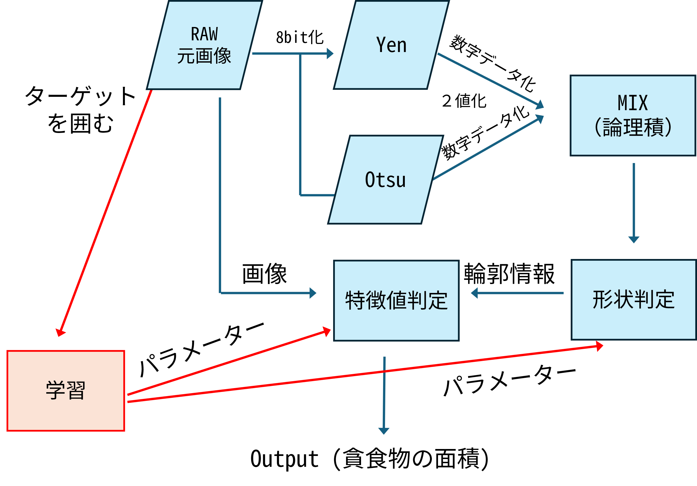
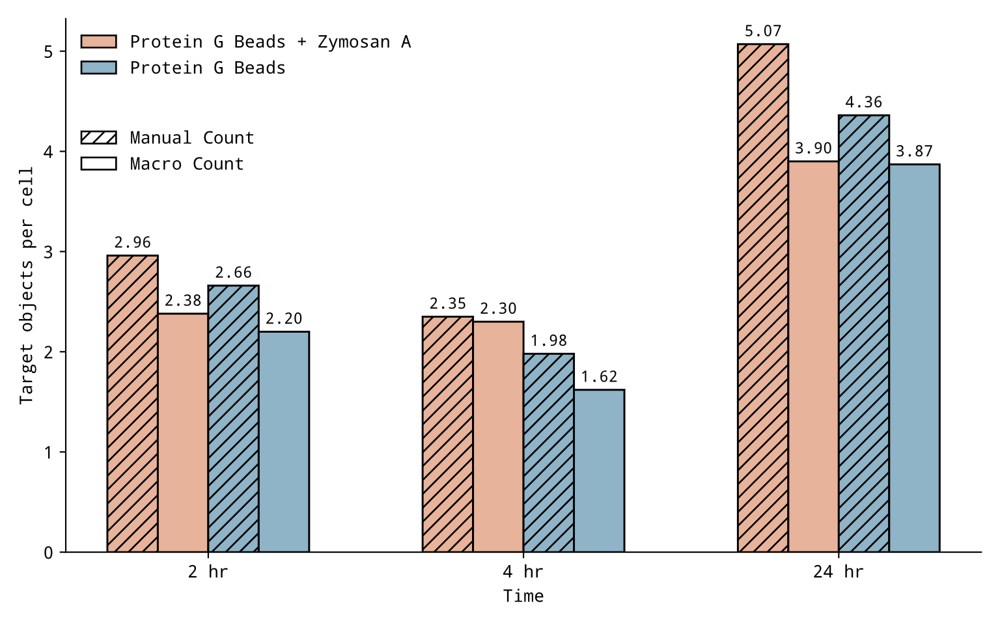

# Macrophage Image Four-Factor Analysis (v4.0.0)

## Notices

> Haibao Project Migration
> The desktop and UI planning and implementation work has been moved to the standalone Haibao project: [KiriKirby/neoxp-haibao](https://github.com/KiriKirby/neoxp-haibao).
> If you are looking for the Electron-based Haibao application, use that repository instead of this Fiji macro repository.

> English-Only Documentation
> This repository previously maintained documentation in English, Chinese, and Japanese.
> The maintenance cost became too high, so after version 4.0.0 this repository keeps English documentation only.
> The previous multilingual README set has been archived in `olddoc/`.

> Maintenance Status
> This project is currently in a slow maintenance phase because the maintainer has moved to a different laboratory.
> Critical fixes and selected updates may still be made, but development is no longer in a rapid iteration phase.

## Document Origin and Sharing Scope

> AI-Generated README Notice
> This README was generated with AI assistance from thesis-derived script materials, the currently published repository contents, and the active `4.0.0` Fiji macro.
> The underlying thesis document is a private asset of the Nishikata Laboratory at Konan University.
> This repository publicly shares only the portions of the experimental methods, algorithm description, validation results, and supporting materials that were approved for open release.
> All content already committed to this repository has been reviewed and is shared under the licenses shown in this repository.

## Document Structure

This README is intended as a public companion document to the thesis-derived script materials rather than as a brief repository note.

It is organized into three major parts:

1. Principle and method
2. Validation and confirmation experiments
3. Practical step-by-step usage

The first part describes the analytical objective of the script, the thesis-level method, and the way in which the current `4.0.0` implementation extends that baseline.

The second part summarizes the validation logic and the script-relevant experimental findings documented in the thesis.

The third part serves as an operating manual for the current repository state, with direct attention to the actual behavior of the `4.0.0` Fiji macro.

## Repository at a Glance

- Active macro: `Macrophage Image Four-Factor Analysis_4.0.0.ijm`
- Locked historical reference: `Macrophage Image Four-Factor Analysis_3.0.2.ijm`
- Older archived macro versions: `old/`
- Archived old multilingual README files: `olddoc/`
- README figure assets: `readme-assets/`
- Required runtime: Fiji

This repository should be treated as Fiji-only. It is not maintained for plain ImageJ compatibility.

---

## Part I. Principle and Method

### 1. Scientific Problem

This project was developed to address a specific microscopy-analysis problem arising in macrophage phagocytosis experiments.

In mixed-particle conditions, researchers may need to answer questions such as:
- how much of a specific particle class has been phagocytosed;
- whether uptake differs between single-particle and mixed-particle conditions;
- whether fluorescence labeling is necessary for every measurement;
- whether manual counting remains reliable when particles are clumped, partially overlapping, or visually ambiguous.

The thesis-backed solution documented here is a Fiji macro that quantifies target particles from brightfield images and converts the result into a normalized per-cell metric.

The central analytical idea is straightforward in principle, but demanding in practice:
- detect candidate target particles directly from brightfield image structure;
- reject background, intracellular non-target structures, and debris;
- correct large merged detections that represent multiple particles;
- measure total detected particle area;
- normalize that area by cell count;
- compare conditions in a way that is less observer-dependent than manual counting.

### 2. Why Brightfield-Based Quantification Matters

The thesis argues that a brightfield-based method is valuable because fluorescence-only workflows have practical limitations.

Important motivations include:
- fluorescence labeling can change particle surface properties;
- multiple particle classes may require multiple labels, increasing experimental burden;
- some experiments need comparison between labeled and unlabeled conditions;
- manual counting becomes unstable when particles clump or outlines are not visually clean.

The method in this repository therefore uses brightfield analysis as the primary quantitative backbone, while allowing fluorescence to be used as an optional complementary signal in the current `4.0.0` macro.

### 3. Thesis Baseline: What the Original Script Was Designed to Do

The thesis-level baseline method can be summarized as follows:

1. Open brightfield microscopy images in Fiji.
2. Convert raw images to an 8-bit working representation.
3. Apply automatic thresholding by Yen and Otsu methods.
4. Intersect the threshold outputs with a logical AND step to stabilize candidate extraction.
5. Apply cleanup and candidate separation operations.
6. Extract particle candidates with geometric filtering.
7. Re-evaluate surviving candidates by brightness and local contrast.
8. Learn parameters from manually sampled target particles before running the full analysis.
9. Correct large merged candidates as clumps based on learned representative single-particle area.
10. Output total particle area and normalize by cell count to obtain a per-cell index.

The thesis uses this framework to quantify phagocytosed particles from brightfield images without making fluorescence labeling the sole path to quantification.

### 4. Core Quantification Concept

The thesis does not frame the method primarily as object counting in the naive sense. Instead, it uses detected target area as the main physical image-derived quantity.

That distinction matters.

In brightfield microscopy of phagocytosed particles:
- object borders may be incomplete;
- touching particles may fuse into one region;
- shape may vary by focus, sample preparation, and intracellular state;
- observer counting may shift when a clump could be interpreted as one, two, or more particles.

Using area as the core detected quantity allows the method to remain useful even when discrete object boundaries are imperfect. The script then uses learned single-particle scale information to interpret large regions more sensibly.

The thesis describes the normalized readout as `target pixels per cell`, meaning:

`detected target area / cell count`

This repository’s later versions generalize that logic into multiple output metrics, but the thesis-centered interpretation remains anchored in that same area-per-cell principle.

### 5. Flowchart of the Thesis Method

The flowchart extracted directly from the thesis is reproduced below.

This figure captures the essential architecture of the original method:
- the blue blocks represent the image-analysis path;
- the red blocks and arrows represent the learning path;
- the learning path feeds parameter estimation back into the analysis path.

In practical terms, this means the method is not purely hard-coded. It expects a pre-analysis sampling step in which the user teaches the script what a typical target looks like under the current imaging condition.

### 6. Detailed Thesis Method

#### 6.1 Software Environment

The thesis explicitly uses Fiji (ImageJ) as the execution environment. That is still true for the current repository. The macro should be treated as Fiji-only.

#### 6.2 Image Conversion and Noise Reduction

The thesis method converts the source image into an 8-bit representation and applies median filtering before thresholding. This serves two purposes:
- standardize the working image type for threshold algorithms;
- reduce unstable local pixel noise that would otherwise create false binary fragments.

#### 6.3 Dual Thresholding by Yen and Otsu

The method then applies both Yen and Otsu thresholding. These two threshold families respond differently to image histograms, and the thesis workflow intentionally uses both rather than trusting a single binarization result.

This dual-threshold design is one of the key technical choices of the script.

It reflects a pragmatic assumption:
- if two different automatic threshold views both support a candidate, that candidate is more trustworthy than one found by only one unstable threshold result.

#### 6.4 Logical AND Integration

After thresholding, the two binary results are intersected by a logical AND operation.

This step is not cosmetic. It is central to the script logic because it suppresses candidates that appear only under one threshold condition and therefore may reflect:
- uneven background;
- noise;
- low-confidence brightfield texture;
- threshold-specific artifacts.

#### 6.5 Morphological Cleanup and Separation

The thesis describes the use of binary cleanup such as hole filling and opening, followed by watershed-based splitting when necessary. These operations reduce fragmentation and help separate touching candidates before measurement.

This is particularly important because a brightfield particle field can contain:
- near-touching targets;
- weakly connected target regions;
- artifacts that look like small particle islands.

#### 6.6 Shape Judgment

Candidate regions are extracted by `Analyze Particles` and filtered by shape-related constraints such as area and circularity-like bounds.

The goal of this stage is not to declare final target identity. It is to remove obviously implausible regions before deeper evaluation.

At this stage, the script is asking:
- is the region too small to be credible;
- is it too large to be a normal single target;
- is its geometry too far outside the expected target range;
- is it worth carrying forward for feature-level inspection.

#### 6.7 Feature-Value Judgment

The thesis then adds a second decision layer by examining local brightness-derived features from the raw image itself.

This is essential because shape alone is not enough. Intracellular texture, debris, and other non-target structures can sometimes pass geometric filtering.

The feature stage therefore evaluates whether the candidate’s image appearance is compatible with a true target.

The thesis specifically describes brightness-difference and local-contrast style features. In conceptual terms, this stage asks:
- does the candidate center behave like a real target;
- does it differ enough from its surrounding ring or local neighborhood;
- is its contrast relationship consistent with target appearance rather than background clutter.

#### 6.8 Parameter Learning

The thesis method is not intended to run with a single fixed universal parameter set. Instead, it starts with a learning phase in which the user manually marks representative target particles.

From those samples, the script estimates:
- representative single-particle area;
- minimum area;
- maximum area;
- shape thresholds;
- brightness-difference thresholds;
- contrast thresholds.

This is a major conceptual feature of the project. The script is not just an image filter; it is a guided analysis system whose defaults are inferred from the current data.

#### 6.9 Clump Handling

The thesis also addresses clumped particles. If a detected region is larger than the learned representative single-particle scale by a sufficient factor, the script treats it as a clump rather than as a normal single target.

This matters because clumps are where manual counting often becomes unstable.

Under clumped conditions, the script’s area-based correction provides a fixed-rule estimate instead of forcing the user to guess how many visually fused particles are present.

#### 6.10 Final Quantitative Output

The thesis uses total detected target area as the fundamental measured output and normalizes that by cell count.

As a result, the method is designed to support condition-to-condition comparison through a per-cell quantity rather than raw image totals alone.

This per-cell normalization is critical, because otherwise a field with more cells would trivially appear to show more uptake.

### 7. From Thesis Baseline to Current 4.0 Macro

The thesis explains the intellectual core of the method. The current `4.0.0` script expands that core into a much broader analysis framework.

The modern script adds:
- guided multi-phase execution;
- ROI annotation workflows;
- ROI zip save/load management;
- automatic ROI mode based on Otsu/Yen logic;
- explicit feature-class selection (`F1` to `F6`);
- optional exclusion learning and exclusion filtering;
- optional fluorescence image matching by filename prefix;
- fluorescence color sampling and tolerance settings;
- `PARAM_SPEC` import and export for reproducibility;
- deterministic results-table formatting;
- structured logging and user-facing error codes.

That means the current repository contains both:
- a thesis-derived method; and
- a substantially expanded analytical tool built on top of that method.

### 8. Current 4.0 Detection Architecture

The active `4.0.0` macro is not a single-path detector anymore.

Its current design includes:
- round-object feature classes (`F1`, `F2`, `F5`, `F6`);
- clump-oriented feature classes (`F3`, `F4`);
- special in-cell handling for `F4`;
- mutual exclusion between `F1` and `F5`;
- exclusion as a post-detection filter rather than a target generator;
- optional fluorescence-derived companion quantification.

This is an important repository-level distinction:

The thesis validates the core brightfield quantification strategy. The current macro generalizes that strategy into a configurable multi-feature analysis pipeline.

### 9. Current 4.0 Output Logic

The current script can output a richer family of metrics than the thesis baseline.

Common output tokens include:
- `TB`: total target quantity
- `BIC`: in-cell target quantity
- `CWB`: cells with target
- `TC`: total cells
- `TPC`: target quantity per cell
- `ETPC`: mean target quantity per cell across a group
- `TPCSEM`: standard error of the per-cell quantity

When fluorescence mode is enabled, the script can also add prefixed fluorescence columns alongside relevant base metrics.

The current script also supports:
- side-by-side PN layout;
- optional time parsing;
- deterministic grouping by PN and time;
- controlled per-cell expansion in normal mode;
- summary-only behavior for `TPC`, `ETPC`, and `TPCSEM` in auto ROI mode.

### 10. Limits of Interpretation

This repository is powerful, but it is not magic.

The method remains dependent on:
- image quality;
- sensible sampling;
- representative learning ROIs;
- compatibility between the chosen features and the actual target appearance;
- consistent cell segmentation logic when using ROI-based or auto ROI workflows.

The right way to read this repository is:
- the thesis gives the scientific and algorithmic foundation;
- the current macro makes that foundation operational for broader analysis;
- every new biological use case should still be checked against actual image behavior.

---

## Part II. Validation and Confirmation Experiments

### 11. Why Validation Was Necessary

Any brightfield-derived quantification workflow needs validation because it sits between two risks:
- under-detection, where true targets are missed;
- over-detection, where debris or structure is counted as target.

The thesis therefore does not stop at algorithm description. It explicitly evaluates whether the script produces trustworthy measurements under real experimental conditions.

The validation logic has three layers:

1. Direct methodological validation against manual counting
2. Application to single-particle versus mixed-particle conditions
3. Cross-checking with fluorescently labeled Zymosan in a known mixing ratio

### 12. Direct Validation Against Manual Counting

The most important script-validation result in the thesis is the comparison between manual counting and macro-based quantification on the same brightfield images.

This figure is the clearest methodological justification for the script.

The thesis conclusion can be summarized precisely:
- when particles were dispersed, manual and macro results were broadly consistent;
- when particles were clumped, manual counting became more observer-dependent;
- the macro remained more stable because clump handling followed a fixed algorithmic rule.

This is exactly the kind of result one would want from this type of script.

The claim is not that the macro always outperforms manual counting in every conceivable condition. The thesis claim is narrower and more defensible:
- manual counting is acceptable in relatively easy conditions;
- the macro becomes especially valuable in harder clumped conditions where subjective interpretation becomes unstable.

### 13. What This Validation Actually Proves

The manual-versus-macro comparison supports several practical conclusions.

First, it shows that the script is not detached from human interpretation. In simpler cases, it tracks manual assessment reasonably well.

Second, it shows that the value of the script is not just speed. Its main advantage is standardization under ambiguity.

Third, it supports the design decision to use clump correction rather than raw disconnected-object counting alone.

For users of the repository, this means:
- if your images are easy, the script should behave in a way that is intuitively acceptable;
- if your images contain many merged or ambiguous targets, the script is likely more reproducible than direct manual counting.

### 14. Mixed-Particle Comparison in the Thesis

After validating the method, the thesis uses the script to compare uptake under different particle conditions.

The particle systems discussed in the thesis are:
- Protein G Beads
- Zymosan A
- mixed conditions containing both

The key experimental question is whether mixed-particle exposure produces strong competition or distortion in early uptake.

The thesis reports that at the early `2 h` stage:
- Protein G Beads uptake in mixed conditions did not show a major departure from single-particle conditions;
- Zymosan uptake likewise did not show a major single-versus-mixed separation;
- total uptake in the mixed condition was approximately additive.

This is not merely a biology statement. It is also a confirmation that the script produces condition-sensitive quantitative outputs that can support mechanistic interpretation.

### 15. Ratio Confirmation with Normal and Fluorescent Zymosan

The thesis then uses a ratio-based confirmation experiment involving normal Zymosan A and fluorescent Zymosan A mixed at `3:1`.

This experiment is especially important for the script because it provides a partial internal consistency check between:
- brightfield-derived total signal;
- fluorescence-derived subset signal.

The thesis reports a representative result of:
- total Zymosan quantity: `5652`
- fluorescent Zymosan quantity: `1140`
- observed ratio: approximately `4.01:1`

The interpretation given in the thesis is that this ratio is close to the theoretical `4:1` expectation and therefore does not suggest a major uptake distortion introduced by fluorescent labeling under the tested condition.

From the perspective of the script, this supports two points:
- the brightfield-based measurement was behaving coherently enough to support ratio interpretation;
- fluorescence can serve as a useful partial confirmation channel rather than as the only quantitative basis.

### 16. Higher-Level Interpretation Supported by the Script

The thesis does not stop at reporting raw measurements.

It uses script-derived quantification to support broader interpretations such as:
- early mixed-particle uptake behaves roughly additively rather than strongly competitively;
- retained and digested particle behavior can be discussed conceptually from the relationship between brightfield and fluorescence signals;
- non-digestible particles such as Protein G Beads may show non-monotonic per-cell trajectories that are not trivially explained by cell count changes alone.

These interpretations should be read carefully.

They are not claims that the macro directly measures every underlying biological mechanism. Rather, the macro provides stable quantitative observables from which those interpretations can be argued.

### 17. What the Thesis-Backed Evidence Supports

Taken together, the thesis-backed evidence supports the following script-level claims:

- A Fiji-based brightfield macro can quantify target particle uptake without depending entirely on fluorescence labels.
- The method is consistent with manual assessment when images are relatively easy.
- The method is more reproducible than manual counting under clumped-particle conditions.
- The resulting measurements are stable enough to compare single-particle and mixed-particle conditions.
- Fluorescence-derived subset measurements can be used as a meaningful cross-check in at least some mixed Zymosan settings.

### 18. What the Thesis-Backed Evidence Does Not Automatically Prove

The thesis does not automatically prove:
- universal performance under any particle morphology;
- universal transferability to other imaging systems;
- identical performance for every feature option in the much newer `4.0.0` script;
- universal correctness of every fluorescence-related option in all datasets.

That boundary matters because the current repository is broader than the thesis baseline.

The safest reading is:
- the thesis validates the core brightfield quantification philosophy and its original implementation logic;
- the current script is an expanded tool that should still be validated on new image styles and new biological contexts.

---

## Part III. Practical Usage Guide for the Current 4.0 Macro

### 19. General Preparatory Conditions

Before the macro is started, the user should verify the following conditions.

- Fiji is available and functioning normally.
- The target dataset has been organized in a consistent directory structure.
- The intended analytical path has been decided in advance: ROI-based analysis or auto ROI analysis.
- If fluorescence is to be used, fluorescence images are stored in a way that permits reliable matching by filename prefix.
- The user has decided whether parameters will be learned interactively or supplied through a previously saved `PARAM_SPEC`.

At the practical level, first use is best performed on a small representative subset rather than on the full dataset. This allows the user to verify ROI quality, target appearance, sampling strategy, output layout, and file-matching behavior before committing to a full batch run.

### 20. Work Modes

The current macro opens with a work-mode dialog. Four modes are available.

#### 21.1 Annotate Cell ROIs Only

This mode is intended for manual cell annotation without immediate downstream analysis.

Operational behavior:
- images are opened one by one;
- you draw cell outlines manually;
- each cell ROI is added to ROI Manager;
- the script saves a zip file for that image.

This mode is appropriate when:
- you want to annotate cells now and analyze later;
- you need to correct ROI files without rerunning the whole analysis;
- you are building a curated ROI library for repeated analysis.

#### 21.2 Analyze Only

This mode assumes that cell ROI zip files already exist and can be loaded directly.

Operational behavior:
- the script expects a corresponding cell ROI zip for each image;
- target detection, optional exclusion handling, and output generation are performed directly.

This mode is appropriate when:
- cell ROIs are already complete and trustworthy;
- you want repeat analysis with changed parameters;
- you want to compare output settings without redrawing ROIs.

#### 21.3 Annotate Cell ROIs, Then Analyze

This is the recommended general-purpose mode for first analysis of a new ROI-based dataset.

Operational behavior:
- missing cell ROIs are created first;
- target sampling is performed;
- exclusion sampling is performed if relevant;
- default parameters are estimated;
- the batch analysis then runs.

This mode is appropriate when:
- you are working on a fresh dataset;
- ROIs are incomplete or absent;
- you want the most transparent full workflow.

#### 21.4 Analyze with Auto ROI (Otsu/Yen)

This mode replaces stored ROI files with threshold-derived cell-region logic.

Operational behavior:
- ROI zip files are not loaded;
- in-cell and out-cell regions are inferred from Otsu/Yen logic;
- you perform a separate single-cell area sampling step;
- cell count is later estimated from Otsu-derived area divided by mean single-cell area.

This mode is appropriate when:
- manual cell ROI annotation would be too costly;
- your images are suitable for threshold-derived cell-region logic;
- you accept that automatic ROI mode is more assumption-dependent than curated ROI mode.

### 21. Recommended First Practical Run

For an initial run on a new dataset, the most conservative procedure is as follows.

1. Select a small but representative subset of images.
2. Open Fiji and run `Macrophage Image Four-Factor Analysis_4.0.0.ijm`.
3. Choose `Annotate cell ROIs, then analyze (recommended)`.
4. Leave fluorescence disabled unless matching fluorescence images are already prepared.
5. Leave interactive learning enabled unless a trusted `PARAM_SPEC` already exists.
6. Complete the ROI and target-sampling stages carefully.
7. Inspect the proposed parameters before continuing to the full dataset.
8. Save the resulting `PARAM_SPEC` once a satisfactory run has been obtained.

This staged approach is preferable to a full-scale first run because it exposes the learned assumptions of the script before large-batch processing begins.

### 22. Phase 1: UI Language Selection

The macro begins by asking the user to choose the interface language. This choice governs the UI strings, logging labels, and dialog text shown during the remainder of the run.

From an analytical standpoint, this phase does not alter image-processing behavior. Its sole purpose is to ensure that the subsequent dialogs can be read safely and unambiguously by the operator.

Recommendation:
- choose the language in which you can most reliably interpret instructions, warnings, and parameter labels;
- do not change language casually between runs if the outputs and logs will later be compared manually.

### 23. Phase 2: UI Text Initialization

After the language is chosen, the script initializes the corresponding text resources. This phase is not user-configurable, but it matters for later interpretation because every dialog, log line, parameter explanation, and error code wrapper is assembled here.

In practical terms, this means that:
- labels shown in later dialogs belong to one internally consistent language block;
- the same runtime logic may present different wording depending on the chosen language;
- the English documentation in this README should be read as explanatory guidance, not as a guarantee that the current run is also using the English UI.

### 24. Phase 3: Mode Selection and Global Run Options

This phase determines the overall analytical route for the session.

The user chooses:
- one of the four work modes;
- whether fluorescence images will be included by prefix;
- whether interactive learning will be skipped in favor of manual parameter entry or `PARAM_SPEC`.

This is one of the most consequential decisions in the workflow because it determines whether later phases will include:
- ROI creation;
- single-cell area sampling;
- target sampling;
- exclusion sampling;
- fluorescence-color sampling;
- or direct parameter entry only.

If `Skip learning` is enabled:
- target, exclusion, and fluorescence sampling stages are omitted;
- the parameter dialogs become the primary source of configuration;
- the run becomes more dependent on operator knowledge and prior parameter records.

### 25. Phase 4: Folder Selection, File Discovery, and Structural Interpretation

In this phase, the user selects the working directory. The macro then scans the folder structure and constructs the image list.

Depending on the dataset and settings, the script may also determine:
- whether the directory contains images only or a subfolder structure;
- whether fluorescence image pairing by prefix is possible;
- whether time parsing will later rely on filenames or subfolder names.

This phase should be treated as a data-integrity checkpoint.

Before continuing, the user should ensure:
- the selected directory contains the intended images only;
- any fluorescence files follow a consistent naming convention;
- there is no accidental mixture of incompatible folder structures;
- the intended filename preset will make sense for the observed file names.

### 26. Phase 5: Cell ROI Annotation

This phase is active in ROI-based modes that require manual cell outlines.

The script’s intended operating procedure is:
- use an area-selection tool, typically freehand;
- trace the full cell region rather than only a bright subregion;
- add each completed ROI to ROI Manager with `T`;
- finish the current image before proceeding.

This phase is foundational because in-cell metrics depend directly on ROI quality.

The most important practical rules are:
- every ROI should be a closed area ROI;
- the same drawing standard should be used across the dataset;
- uncertain cell boundaries should still be handled consistently rather than opportunistically;
- partial ROIs should be avoided unless the same rule is applied throughout the experiment.

Poor ROI quality propagates to:
- in-cell target counts;
- in-cell target area;
- cell counts derived from ROIs;
- later feature interpretations involving in-cell classes.

### 27. Phase 6: Single-Cell Area Sampling in Auto ROI Mode

This phase appears only in auto ROI mode.

Its purpose is to estimate the mean area of a typical single cell. That estimate is later used to convert threshold-derived total cell-region area into an inferred cell count.

The user is expected to:
- outline representative single cells manually;
- add each sampled cell ROI to ROI Manager with `T`;
- avoid merged cells, partial cells, and clearly atypical cells;
- continue sampling until the resulting set is reasonably representative.

This phase should be treated as a calibration step rather than as a minor convenience.

If the sampled single-cell areas are biased:
- cell count estimation will be biased;
- all normalized per-cell outputs in auto ROI mode may become misleading.

### 28. Phase 7: Target Object Sampling

This phase is one of the most important parts of the entire workflow.

The current script uses target samples to estimate:
- a typical single-object area scale;
- target size bounds;
- round-feature thresholds;
- clump defaults;
- a suggested rolling-ball background radius.

For good target sampling:
- prefer typical single targets over ambiguous edge cases;
- avoid obvious clumps if the goal is to teach the single-object baseline;
- use reasonably tight ROIs;
- sample enough objects to represent the dataset, not just one favorite image.

If you plan to use clump-related feature classes:
- include larger or irregular targets deliberately when appropriate;
- understand whether the sample is in-cell or out-cell, especially for feature 4 behavior.

A bad target sample set usually causes the script to produce bad default parameters, which users sometimes misinterpret as a bad detector. In reality, the detector is only as good as the samples used to initialize it.

### 29. Phase 8: Exclusion Sampling

This phase is used only when exclusion logic is relevant.

Exclusion sampling does not define the target class. Rather, it defines what should be removed after target detection because it constitutes a systematic false-positive class.

Typical exclusion objects may include:
- debris;
- misleading bright or dark structures;
- non-target objects that otherwise satisfy the target criteria.

When exclusion sampling succeeds, the macro can infer:
- exclusion threshold direction;
- exclusion threshold value;
- optional exclusion size-range defaults.

This phase should be used only when the false-positive class is sufficiently consistent to be sampled deliberately. It is not a substitute for appropriate target-feature selection.

### 30. Phase 9: Parameter Estimation

After the sampling phases have been completed, the script converts the collected ROI information into a provisional parameter set.

Depending on the selected mode and the available samples, this may include estimates for:
- target area range;
- minimum circularity;
- round-feature thresholds;
- clump thresholds;
- exclusion thresholds and size bounds;
- rolling-ball radius;
- mean single-cell area in auto ROI mode.

This phase makes explicit the learning-based character of the macro. The script is not loading a universal preset; it is synthesizing a proposed configuration from the current dataset.

The resulting values should be regarded as informed defaults rather than unquestionable truth.

### 31. Phase 10: Parameter Dialogs

The parameter dialogs are the main point at which the user confirms or edits the learned configuration.

Depending on the run, the script may show two or three pages.

The first page typically addresses:
- target minimum area;
- target maximum area;
- minimum circularity;
- whether clump-based object estimation is allowed;
- feature-specific thresholds, depending on the selected feature set.

The second page typically addresses:
- exclusion settings;
- strictness;
- rolling-ball radius;
- ROI suffix or auto ROI cell-area parameters;
- pixel-count behavior;
- tiny-uptake handling.

The third page appears in fluorescence mode and addresses:
- fluorescence target color;
- near or halo color;
- tolerance values;
- optional fluorescence exclusion colors.

The proposed values should be compared against actual image appearance and known expectations from the sampled objects. This phase is a review step, not a passive confirmation step.

### 32. Phase 11: Parameter Validation and Normalization

After the dialog inputs are collected, the script validates and normalizes the parameter set.

This phase checks for:
- numeric validity;
- internal consistency;
- compatibility with selected feature classes;
- compatibility with data-format settings;
- fluorescence constraints when fluorescence mode is enabled.

Most failures at this stage indicate contradictory or invalid input rather than a defect in the macro itself.

### 33. Phase 12: Data Formatting and Output Configuration

The script then determines how results will be structured and labeled.

Relevant settings include:
- filename preset;
- whether output formatting is enabled;
- table column tokens;
- time-aware grouping;
- per-cell expansion behavior;
- optional debug or fluorescence-tuning settings.

The operator should confirm that:
- the filename preset matches the actual naming convention;
- the selected output tokens correspond to the intended analytical question;
- time parsing, if desired, is compatible with the folder and filename structure used;
- per-cell expansion is appropriate for the selected mode.

### 34. Phase 13: Batch Analysis Loop

Once configuration is finalized, the script iterates through the image set and performs the actual analysis.

During this phase the macro:
- loads the image or image pair;
- loads or infers cell regions depending on the chosen mode;
- performs target detection;
- applies feature logic and optional clump handling;
- applies optional exclusion filtering;
- applies optional fluorescence calculations;
- stores intermediate results for later output assembly.

This is the main computational phase, but its quality is determined largely by the correctness of the previous phases.

### 35. Phase 14: Results Output

In the output phase, the script assembles the final results table.

Important behaviors of the current implementation include:
- PN blocks are placed side by side;
- time-aware output is grouped by ascending numeric time;
- shorter groups are padded with empty strings rather than compressed;
- `TPC`, `ETPC`, and `TPCSEM` may trigger per-cell row expansion in normal mode;
- auto ROI mode keeps those metrics as summary columns rather than per-cell expanded rows.

The operator should therefore distinguish between the values themselves and the layout logic used to display them.

### 36. Phase 15: Finish, Review, and Reproducibility Capture

The final phase presents the end-of-run state and allows the operator to review what has been produced.

At this point the user should:
- inspect the results table;
- inspect the logs;
- confirm that fluorescence pairing behaved as expected, if applicable;
- save the emitted `PARAM_SPEC` for reproducibility;
- decide whether the current run is satisfactory enough for repetition on the full dataset.

### 37. Feature Selection in the Current Script

The current `4.0.0` script supports six feature classes:
- `F1`
- `F2`
- `F3`
- `F4`
- `F5`
- `F6`

Important constraints from the current script behavior are as follows:
- `F1` and `F5` are mutually exclusive;
- `F4` is in-cell only;
- the selected feature set determines which feature-threshold parameters appear in the parameter dialogs.

In practical use:
- round-object use cases are typically centered on `F1`, `F2`, `F5`, and `F6`;
- clump-oriented use cases rely mainly on `F3` and `F4`;
- feature over-selection should be avoided, because it often increases interpretive ambiguity rather than improving detection.

### 38. `PARAM_SPEC` and Reproducible Reruns

The current macro provides a structured reproducibility mechanism through `PARAM_SPEC`.

The user may:
- paste a `PARAM_SPEC=...` line into the parameter dialog;
- or copy the emitted `PARAM_SPEC` line from a previous run and reuse it later.

Important behavior of the current implementation includes:
- if a non-empty `PARAM_SPEC` is supplied, manual settings below it are ignored;
- the emitted string contains a fixed full key set;
- empty values are skipped during application;
- numeric `0` is treated as a valid value rather than as an empty value.

For repeated experiments or later review, `PARAM_SPEC` is substantially more reliable than manual recollection of dialog choices.

### 39. Common Failure Modes and Diagnostic Strategy

When a run appears incorrect, the most common causes are:
- missing ROI zip files in `Analyze only` mode;
- poor ROI outlines;
- poor target sampling;
- excessive or inappropriate feature selection;
- fluorescence files missing or mismatched by prefix;
- filename presets that do not match the actual naming pattern;
- misunderstanding of per-cell versus summary output layout;
- unsuitable image quality for auto ROI logic.

The recommended diagnostic order is:

1. Verify the image and folder inputs.
2. Verify ROI quality or auto ROI suitability.
3. Reassess target and exclusion samples.
4. Reassess the selected feature set.
5. Reassess the parameter dialogs and any pasted `PARAM_SPEC`.
6. Re-read the logs before altering the script itself.

### 40. Recommended Good Practice and Scope of This Manual

The following procedural recommendations are strongly advised.

- Use mode 3 for the first serious run on a new ROI-based dataset.
- Begin with a pilot subset rather than the full dataset.
- Keep ROI drawing standards consistent.
- Sample typical targets before unusual ones.
- Use exclusion only for a clearly defined false-positive class.
- Save useful `PARAM_SPEC` outputs systematically.
- Enable fluorescence mode only when the corresponding pairing logic is genuinely available.
- Treat auto ROI mode as a distinct analytical route with its own assumptions.

This manual is intended to explain:
- how the current macro behaves in operational terms;
- how the thesis-derived method maps onto the present implementation;
- how a careful user may conduct the workflow in a controlled way.

It is not a substitute for direct examination of the source images. The repository is an analytical instrument, not a guarantee that every dataset can be analyzed correctly under arbitrary settings.

---

## Script-Related References

The following references from the thesis are directly relevant to the script, image-processing method, or software basis of this repository.

1. Schindelin J, Arganda-Carreras I, Frise E, Kaynig V, Longair M, Pietzsch T, et al. Fiji: an open-source platform for biological-image analysis. Nature Methods. 2012;9(7):676-682. DOI: 10.1038/nmeth.2019.
2. Yen JC, Chang FJ, Chang S. A new criterion for automatic multilevel thresholding. IEEE Transactions on Image Processing. 1995;4(3):370-378. DOI: 10.1109/83.8366472.
3. Otsu N. A threshold selection method from gray-level histograms. IEEE Transactions on Systems, Man, and Cybernetics. 1979;9(1):62-66. DOI: 10.1109/TSMC.1979.4310076.
4. Vincent L, Soille P. Watersheds in digital spaces: an efficient algorithm based on immersion simulations. IEEE Transactions on Pattern Analysis and Machine Intelligence. 1991;13:583-598. DOI: 10.1109/34.87344.

## License

This macro script is released under CC0 1.0 Universal (Public Domain Dedication). See `LICENSE`.

This repository also contains third-party software and fonts under their own licenses. See `THIRD_PARTY_NOTICES.md`.
